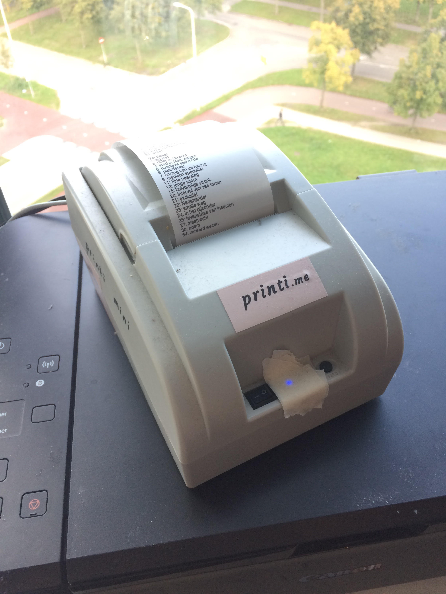
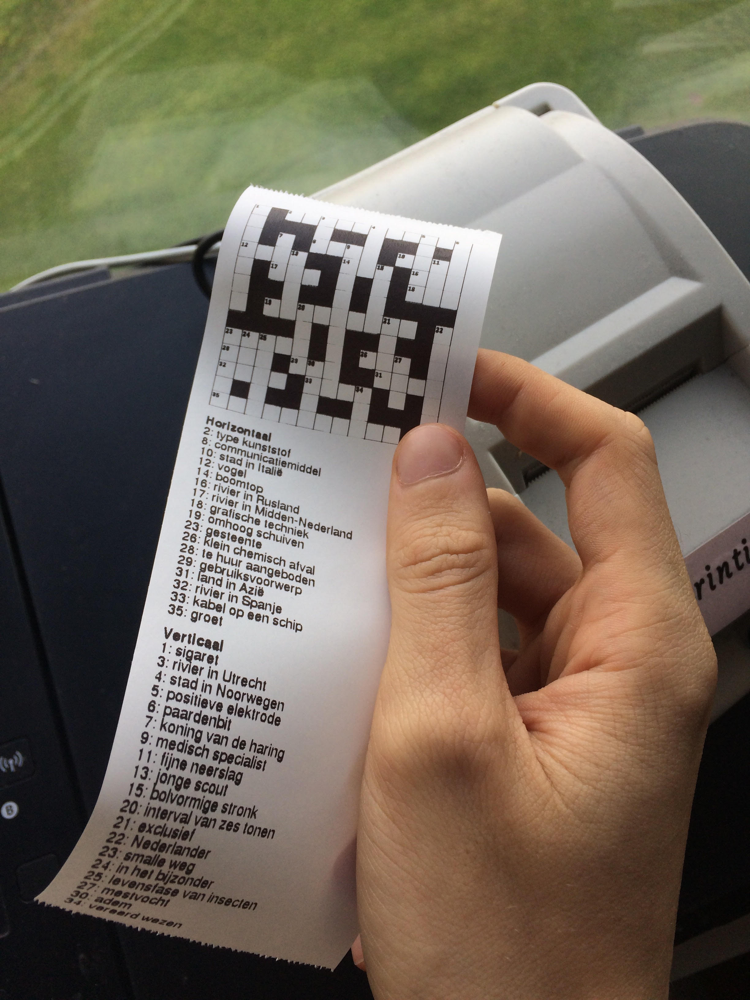

# printi-my-crosswords
Send crosswords to a thermal printer!

### Details
My [crossword generator](https://github.com/lukavdplas/crossword-maker) exports crossword puzzles as xml files. This module imports those xml files. It then converts the crossword and the clues to a bitmap image using Pillow, and sends it to a thermal printer with printi software, using the [printipigeon](https://github.com/fonsp/printi-pigeon) module.

### Picture!

### Future improvements
The program works well right now. Some things I may want to add in the future:
* wrap text for descriptions (most descriptions are so short it is not necessary, but just in case).
* add a solution printer.
